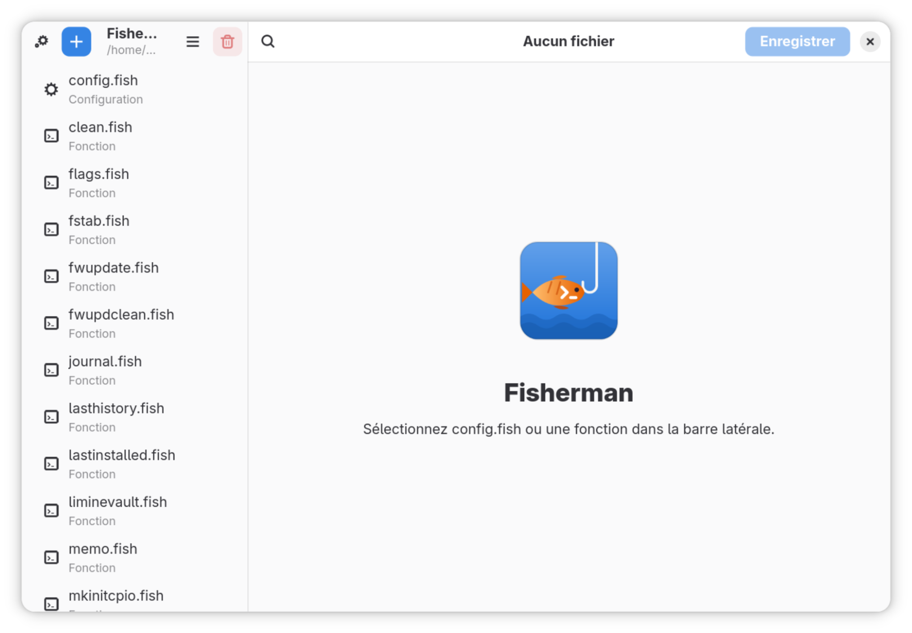

# Fisherman




Application vibe codée en Libadwaita pour gérer les fichiers de configuration de Fish, notamment `config.fish` et les fonctions.

**Paquet fourni : `fisherman-0.1.0-1-any.pkg.tar.zst`.**

## Installation

```fish
sudo pacman -U ./fisherman-0.1.0-1-any.pkg.tar.zst
```

## Désinstallation

```fish
sudo pacman -Rns fisherman
```
