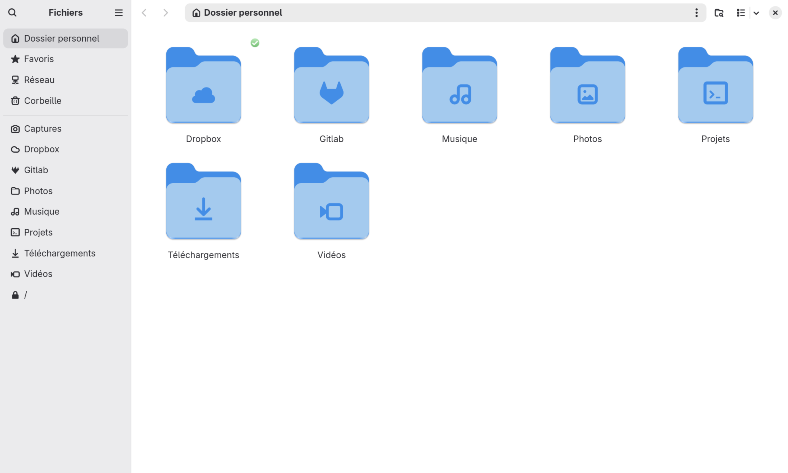

# 7 — GNOME — interface

[Accueil](../README.md) · [Précédent](06-network.md) · [Suivant](08-gnome-extensions.md)

> **Dans ce chapitre :** rendu des polices, échelle, thème visuel, session et alimentation, trousseau, permissions et organisation des lanceurs GNOME.

- [7.1 Ajuster le rendu des polices](#71--ajuster-le-rendu-des-polices)
- [7.2 Régler l'échelle (HiDPI)](#72--régler-léchelle-hidpi)
- [7.3 Fond d'écran, thème de curseurs et GDM](#73--fond-décran-thème-de-curseurs-et-gdm)
- [7.4 Importer et activer le profil couleur de l'écran](#74--importer-et-activer-le-profil-couleur-de-lécran)
- [7.5 Fonctions expérimentales de Mutter](#75--fonctions-expérimentales-de-mutter)
- [7.6 Actions de session, rappels et libellé du profil énergétique (menu d'alimentation)](#76--actions-de-session-rappels-et-libellé-du-profil-énergétique-menu-dalimentation)
- [7.7 Bouton d'alimentation, capot et veille (suspension)](#77--bouton-dalimentation-capot-et-veille-suspension)
- [7.8 Modifier le mot de passe du trousseau](#78--modifier-le-mot-de-passe-du-trousseau)
- [7.9 Régler temporairement les permissions avec malcontent](#79--régler-temporairement-les-permissions-avec-malcontent)
- [7.10 Renommer et organiser les lanceurs (Overview)](#710--renommer-et-organiser-les-lanceurs-overview)
- [7.11 Raccourcis clavier](#711--raccourcis-clavier)
- [7.12 Désactiver les autostarts inutilisés](#712--désactiver-les-autostarts-inutilisés)
- [7.13 Setup d’icônes et dossiers GNOME](#713--setup-dicônes-et-dossiers-gnome)

## 7.1 — Ajuster le rendu des polices

Éditer le fichier d'environnement :

```fish
sudoedit /etc/environment
```

Ajouter :

```ini
FREETYPE_PROPERTIES="cff:no-stem-darkening=0 autofitter:no-stem-darkening=0"
```

Se déconnecter puis se reconnecter pour appliquer le réglage aux nouvelles applications.

Le README proposait aussi une variante « moins grasse », mais reproduisait exactement la même valeur. Il n'y a donc qu'un réglage distinct à reprendre ici ; aucune seconde valeur n'a été inventée.

## 7.2 — Régler l'échelle (HiDPI)

Dans les paramètres d'affichage, choisir une mise à l'échelle **125 %**.

Le masquage des dossiers Nautilus (Modèles, Bureau, fichiers de fond d'écran) et la personnalisation des icônes de dossiers sont traités dans [Nautilus — workflow](09-nautilus-workflow.md#93--masquer-des-dossiers-et-personnaliser-les-icônes).

## 7.3 — Fond d'écran, thème de curseurs et GDM

Installer le [fond d'écran Fedora 34 nocturne](https://fedoraproject.org/w/uploads/d/de/F34_default_wallpaper_night.jpg), ou le fond **cosmos_dark_blue** du dépôt.

Pour le curseur, utiliser la variante **Phinger NO LEFT Light** du [projet Phinger Cursors](https://github.com/phisch/phinger-cursors/releases). Placer le dossier du thème dans `/usr/share/icons/` ; vérifier son nom réel, attendu ici comme `phinger-cursors-light`.

Dans dconf-editor, régler la taille sur **32** :

```text
org/gnome/desktop/interface/cursor-size
```

Appliquer le thème au compte GDM :

```fish
sudo -u gdm dbus-launch gsettings set org.gnome.desktop.interface cursor-theme phinger-cursors-light
```

Utiliser ensuite **GDM Settings**, notamment pour le fond d'écran de connexion, et importer le fichier **`gdm-settings.ini`** du dépôt. Une fois les réglages effectués, le mémo prévoit de supprimer le paquet de cet outil.

## 7.4 — Importer et activer le profil couleur de l'écran

Importer depuis le repo le profil **ICM/ICC de l'écran** dans **Paramètres GNOME → Couleur**, l'associer à l'écran intégré puis l'activer comme profil utilisé.

## 7.5 — Fonctions expérimentales de Mutter

Dans **dconf-editor**, ouvrir :

```text
org.gnome.mutter experimental-features
```

Conserver les valeurs utiles déjà présentes et activer :

- `scale-monitor-framebuffer` pour la mise à l'échelle fractionnaire (!! Unknown experimental feature 'scale-monitor-framebuffer' - n'est plus reconnue par GNOME 50? ) 
- les deux options XWayland : `auto-close` & `native-scaling` 


## 7.6 — Actions de session, rappels et libellé du profil énergétique (menu d'alimentation)

Afficher l'action de fermeture de session dans GNOME 50 :

```fish
gsettings set org.gnome.shell always-show-log-out true
```

Le mémo propose également cette clé pour les boutons de redémarrage et d'arrêt à l'écran de connexion :

```fish
gsettings set org.gnome.login-screen disable-restart-buttons false
```

Une écriture depuis la session utilisateur ne garantit pas à elle seule l'application à la session GDM ; vérifier le résultat sur l'écran de connexion.

Désactiver le rappel de don GNOME si la clé existe dans la version installée :

```fish
gsettings set org.gnome.settings-daemon.plugins.housekeeping donation-reminder-enabled false
```

### Réglages rapides avec Focus & Boutons

Le renommage manuel du fichier de traduction GNOME Shell n’est plus nécessaire. L’extension maison **Focus & Boutons** peut remplacer directement le libellé **Mode puissance** par **Énergie** et réorganiser la rangée système de Quick Settings.

Elle fournit également les boutons scindés **Réglages** et **Power**, la fermeture automatique de Quick Settings et du panneau Calendrier/Notifications, ainsi que les options d’affichage du calendrier.

Voir [Extensions GNOME — Focus & Boutons](08-gnome-extensions.md#87--focus--boutons) et [Applications Vibe Coded — Focus & Boutons](11-applications-vibe-coded.md#1118--focus--boutons).

## 7.7 — Bouton d'alimentation, capot et veille (suspension)

Éditer la configuration de logind :

```fish
sudoedit /etc/systemd/logind.conf
```

Dans `[Login]`, régler :

```ini
HandlePowerKey=suspend
HandlePowerKeyLongPress=poweroff
HandleLidSwitch=suspend
HandleLidSwitchExternalPower=suspend
```

Appliquer au prochain redémarrage, puis tester le bouton d'alimentation et la fermeture du capot sur secteur et sur batterie.

Désactiver l'ajustement automatique de luminosité :

```fish
gsettings set org.gnome.settings-daemon.plugins.power ambient-enabled false
```

Dans les paramètres d'alimentation GNOME, régler ensuite le délai avant mise en veille à **600 secondes**, soit **10 minutes**, pour le mode d'alimentation souhaité.

## 7.8 — Modifier le mot de passe du trousseau

Dans **Seahorse**, modifier le mot de passe du trousseau concerné et laisser les champs du nouveau mot de passe vides si c'est le comportement souhaité. Reconnecter ensuite le compte Google dans GNOME si nécessaire.

Cette opération concerne le **trousseau de mots de passe**, pas le mot de passe du compte Linux ni l'activation d'une connexion automatique. Un trousseau sans mot de passe n'a plus cette protection de ses secrets sur disque.

## 7.9 — Régler temporairement les permissions avec malcontent

Installer temporairement `malcontent` pour accéder aux réglages d'applications correspondants dans GNOME Control Center :

```fish
sudo pacman -S malcontent
```

Effectuer les réglages voulus, puis retirer le paquet si cette interface n'est plus nécessaire :

```fish
sudo pacman -Rns malcontent
```

## 7.10 — Renommer et organiser les lanceurs (Overview)

Avec **Menu Principal / l'éditeur de menus**, renommer les applications dans la vue d'ensemble et masquer les lanceurs inutiles pour viser une seule page d'applications.

Remplacer également l'icône de Ptyxis par celle de [GNOME Terminal](https://upload.wikimedia.org/wikipedia/commons/d/da/GNOME_Terminal_icon_2019.svg).

### Setup d’icônes et de dossiers

Utiliser ce setup d’icônes et de dossiers.

<p align="center"></p>

## 7.11 — Raccourcis clavier

Dans les paramètres GNOME, affecter :

- La touche **Copilot** à Ptyxis (voir [Shell & terminal](12-shell-terminal.md)).
- **Ctrl+Alt+Suppr** à Ressources.

## 7.12 — Désactiver les autostarts inutilisés

Deux entrées sont visées : le bus d'accessibilité et les notifications Evolution.

La méthode du mémo consiste à renommer les fichiers système :

```fish
sudo mv /etc/xdg/autostart/at-spi-dbus-bus.desktop \
    /etc/xdg/autostart/at-spi-dbus-bus.desktop.disabled

sudo mv /etc/xdg/autostart/org.gnome.Evolution-alarm-notify.desktop \
    /etc/xdg/autostart/org.gnome.Evolution-alarm-notify.desktop.disabled
```

Ces fichiers peuvent être recréés lors d'une mise à jour des paquets. Ne pas confondre ces entrées avec les services utilisateur masqués dans [Allégement système](02-system-cleanup.md#24--masquer-les-services-système-et-utilisateur-inutilisés).

🔗 L'autostart du script de désactivation de XWayland est décrit dans [Allégement système](02-system-cleanup.md#29--désactiver-xwayland-au-démarrage).

## 7.13 — Setup d’icônes et dossiers GNOME

Utiliser ce setup d’icônes d’applications et de dossiers afin de conserver une interface GNOME / Adwaita cohérente.

<p align="center">
  
</p>


### Icônes UI — icônes des applications

Le petit outil Python **Icônes UI** gère les icônes couleur et symboliques des applications installées. Il permet d’importer ou modifier une icône, d’appliquer les changements, de restaurer l’état précédent et d’exporter un nouvel ensemble d’icônes incluant les imports.

Depuis le dossier contenant `icones-ogu.pyz`, lancer :

```fish
python3 icones-ogu.pyz
```

Python 3, GTK4 et PyGObject sont nécessaires. Sur CachyOS GNOME, ils sont normalement déjà présents ; sinon :

```fish
sudo pacman -S python-gobject gtk4
```

**Important :** cette archive gère les icônes des applications, pas les icônes **PLACES** des dossiers personnels. Le gestionnaire PLACES est une application distincte ; son archive n’a pas encore été fournie.

---

[Accueil](../README.md) · [Précédent](06-network.md) · [Suivant](08-gnome-extensions.md)
