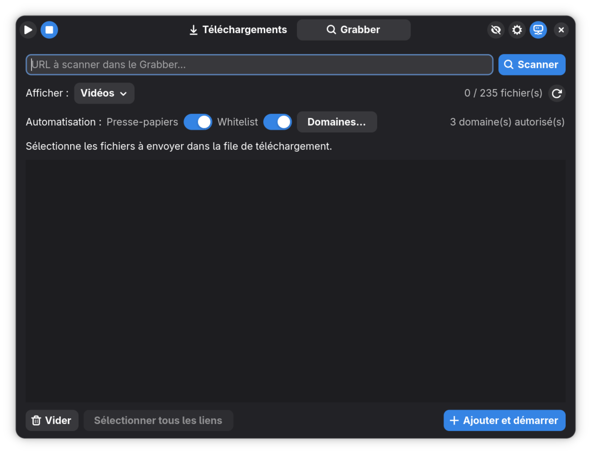
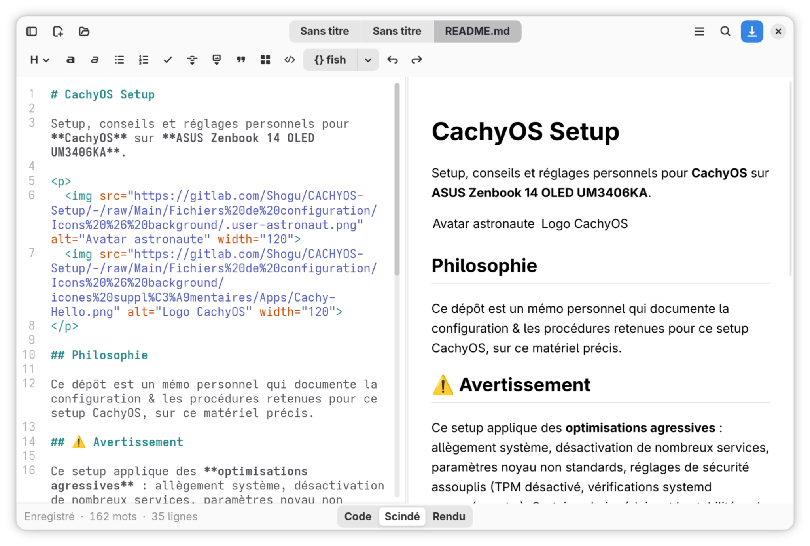
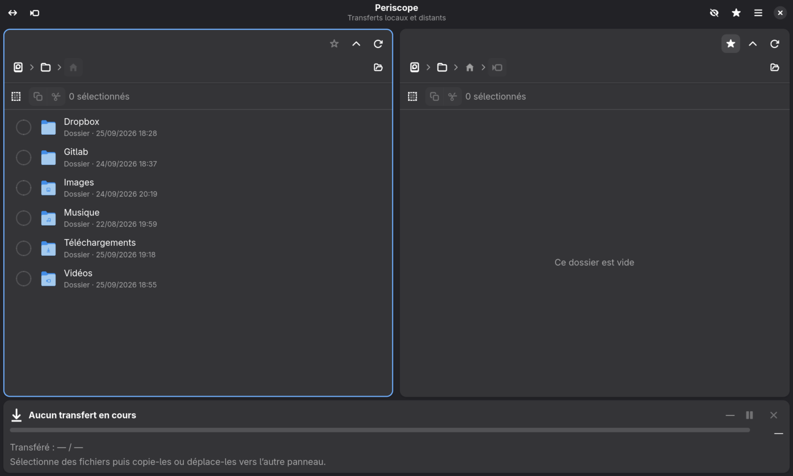
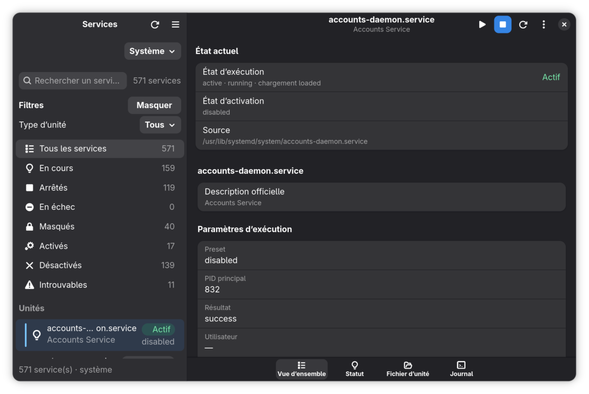
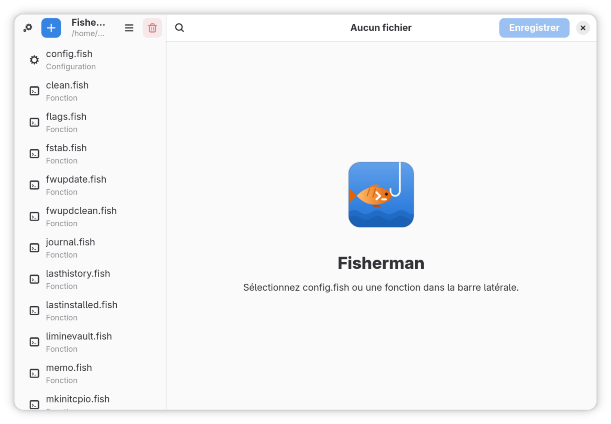
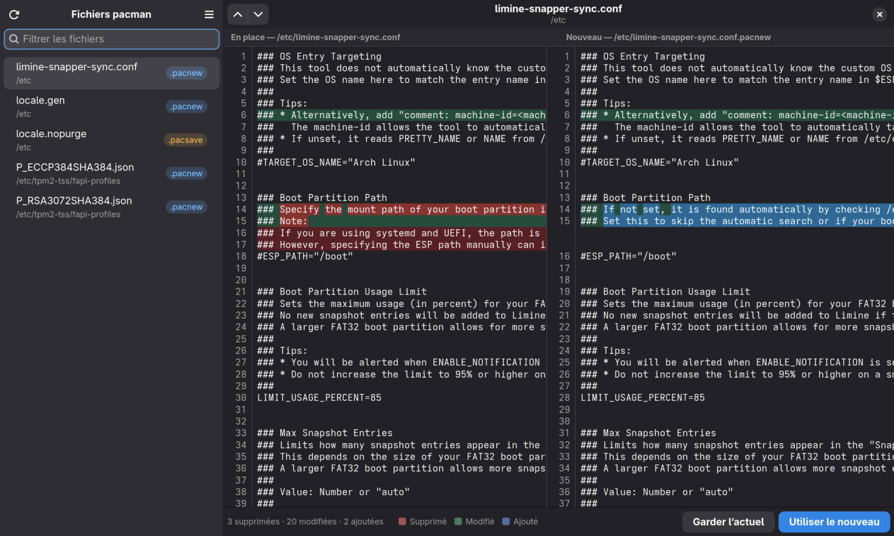
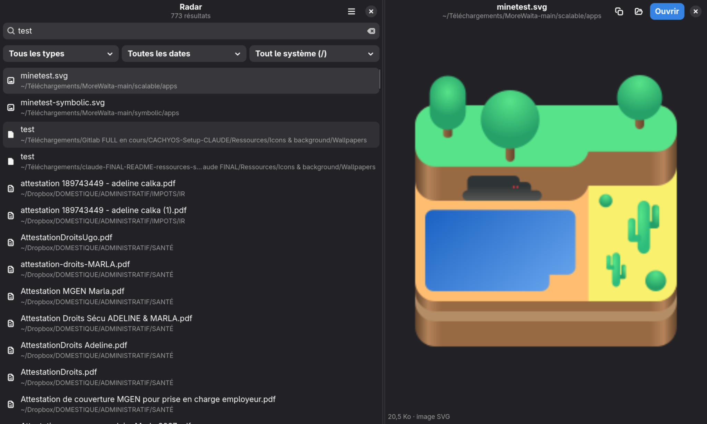
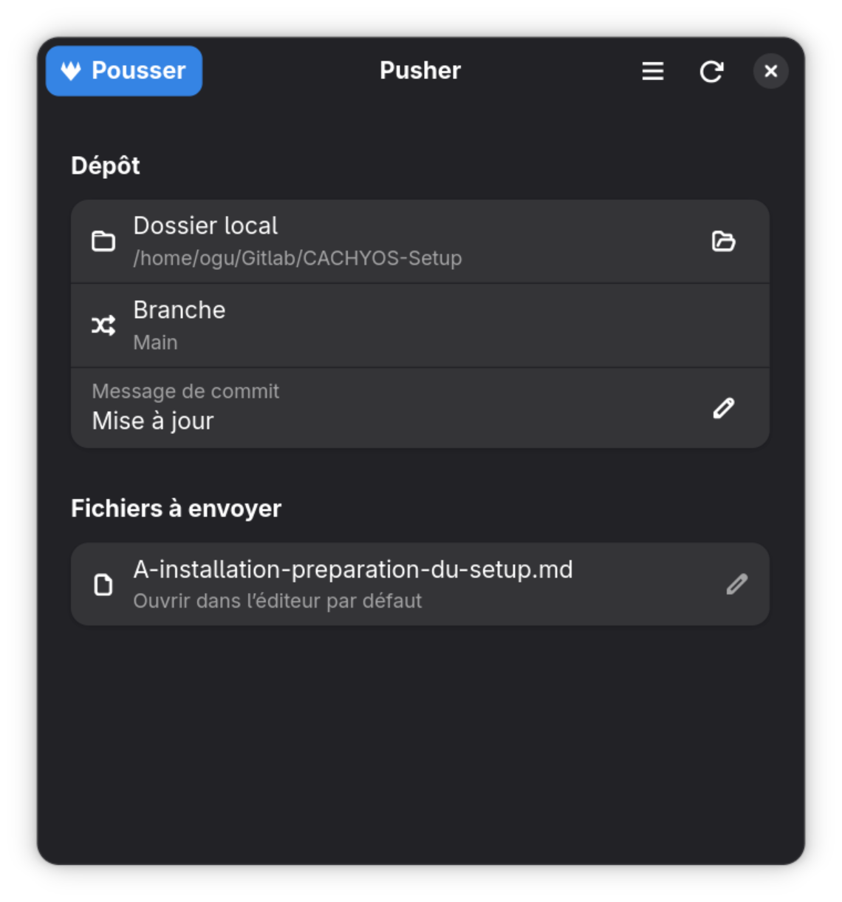

# 11 — Applications Vibe Coded

[Accueil](../README.md) · [Précédent](10-logiciels.md) · [Suivant](12-shell-terminal.md)

> **Dans ce chapitre :** applications personnelles développées avec l'aide du Vibe Coding, principalement en GTK4/libadwaita, dont le fork **Extension Manager**, les extensions GNOME maison « Always on top, always on top », **Musicäa**, **Session Keeper**, **Focus & Boutons**, **Power Total**, **UI Management** et le fork **Battery Time Compact — Ogu**, ainsi qu’un build GTK4 upstream utilisé par le setup.

**Compilation depuis les sources :** [Mail (`mail-postcard`)](10-logiciels.md#1014--messagerie--mail) est compilé avec **Claude** depuis Postcard, avec recherche et affichage des pièces jointes, aperçu des pièces jointes dans le panneau de droite (PDF, images, texte et documents Word/LibreOffice), vue à trois volets avec sélection multiple et menu au clic droit, et purge des copies locales à la fermeture, contraste entre panneaux et francisation complète. La base upstream est conservée ; le paquet est à ajouter manuellement dans `Ressources/Logiciels/Mail/`.

- [11.1 Always on top, always on top](#111--always-on-top-always-on-top)
- [11.2 Grabber](#112--grabber)
- [11.3 Grimoire](#113--grimoire)
- [11.4 Fret](#114--fret)
- [11.5 SCX Manager](#115--scx-manager)
- [11.6 systemd](#116--systemd)
- [11.7 Decibel](#117--decibel)
- [11.8 Fisherman](#118--fisherman)
- [11.9 Pacto](#119--pacto)
- [11.10 Radar](#1110--radar)
- [11.11 Pusher](#1111--pusher)
- [11.12 Nautilus Bookmark Icons](#1112--nautilus-bookmark-icons)
- [11.13 Sismographe](#1113--sismographe)
- [11.14 Snapper GTK4](#1114--snapper-gtk4)
- [11.15 dconf-editor GTK4](#1115--dconf-editor-gtk4)
- [11.16 Musicäa](#1116--musicäa)
- [11.17 Session Keeper](#1117--session-keeper)
- [11.18 Focus & Boutons](#1118--focus--boutons)
- [11.19 Battery Time Compact — Ogu](#1119--battery-time-compact--ogu)
- [11.20 Power Total](#1120--power-total)
- [11.21 UI Management](#1121--ui-management)
- [11.22 Extension Manager](#1122--extension-manager)
- [11.23 Amplifaya — moteur headless et interface](#1123--amplifaya--moteur-headless-et-interface)
- [11.24 Grille](#1124--grille)
- [11.25 Samizdat](#1125--samizdat)

## 11.1 — Always on top, always on top

Extension GNOME Shell minimaliste ajoutant une icône dans la barre supérieure pour activer ou désactiver le mode natif **Toujours au premier plan** de la fenêtre active.

L'extension est compatible GNOME Shell 45 à 50, sans dépendance ni panneau de préférences.


### Installation

Depuis le dossier contenant l'extension :

```fish
gnome-extensions install --force "always-on-top-always-on-top_localhost.shell-extension.zip"
gnome-extensions enable always-on-top-always-on-top@localhost
```

Sous X11, recharger GNOME Shell avec `Alt+F2`, puis `r`. Sous Wayland, se déconnecter puis se reconnecter.

### Désinstallation

```fish
gnome-extensions uninstall always-on-top-always-on-top@localhost
```

---

## 11.2 — Grabber

Frontend GTK4/libadwaita minimaliste pour JDownloader 2. Il permet de récupérer des liens, sélectionner les fichiers utiles, les ajouter à la file de téléchargement et suivre les téléchargements. L'AppImage embarque son propre Java et JDownloader.

**AppImage fournie : `grabber.AppImage`.**



### Installation

Rendre l'AppImage exécutable puis la lancer :

```fish
chmod +x ./grabber.AppImage
./grabber.AppImage
```

Les données persistantes de JDownloader sont conservées dans `~/.local/share/jd-adwaita/jdownloader`.

### Désinstallation

Supprimer l'AppImage. Pour supprimer également les données persistantes de JDownloader :

```fish
rm -rf "$HOME/.local/share/jd-adwaita/jdownloader"
```


Penser à régler son icone avec Menu!

---

## 11.3 — Grimoire

Éditeur Markdown local GTK4/libadwaita utilisant GtkSourceView 5 et WebKitGTK 6. Il permet de parcourir des dossiers de documents Markdown, éditer les fichiers et afficher leur rendu.

**Paquet fourni : `grimoire-ogu-0.2.0-10-x86_64.pkg.tar.zst`.**



### Installation

```fish
sudo pacman -U ./grimoire-ogu-0.2.0-10-x86_64.pkg.tar.zst
grimoire
```

> Si le copier-coller remplace le nom de commande, utiliser simplement `grimoire`.

### Désinstallation

```fish
sudo pacman -Rns grimoire-ogu
```

---

## 11.4 — Fret

Gestionnaire de fichiers GTK4/libadwaita à deux panneaux, inspiré de Nautilus. Chaque panneau peut afficher un emplacement local ou une URI GVfs telle que FTP, SFTP ou SMB. Les transferts sont effectués directement entre les deux panneaux.

**Paquet fourni : `fret-0.2.0-1-any.pkg.tar.zst`.**



### Installation

```fish
sudo pacman -U ./fret-0.2.0-1-any.pkg.tar.zst
```


Pour SMB, installer au besoin :

```fish
sudo pacman -S --needed gvfs-smb
```

### Désinstallation

```fish
sudo pacman -Rns fret
```

---

## 11.5 — SCX Manager

Réécriture native GTK4/libadwaita de SCX Manager pour GNOME. L'application permet de consulter et piloter `scx_loader`, le service D-Bus qui gère les planificateurs Linux `sched-ext`.

**Version du projet : 0.1.2.** L'archive fournie contient le projet source et son `PKGBUILD`, mais pas de paquet binaire précompilé.

### Installation depuis les sources

Décompresser `scx-manager-adwaita-0.1.2-pacman.zip`, puis :

```fish
cd scx-manager-adwaita
makepkg -si
```

Pour une installation utilisateur depuis les sources, suivre le `README` du projet et utiliser son script d'installation avec le préfixe prévu.

### Désinstallation

Pour une installation Pacman :

```fish
sudo pacman -Rns scx-manager-adwaita
```

Pour une installation par script, utiliser le `uninstall.sh` fourni par le projet.

### Capture

Une capture de l'interface SCX Manager n'a pas été fournie dans cet envoi. Elle pourra être ajoutée ultérieurement sous `../Ressources/screenshots/vibe-coded/scx-manager.png`.

---

## 11.6 — systemd



Frontend GTK4/libadwaita pour l'administration graphique des services systemd. L'application utilise `systemctl` et `journalctl` comme sources de vérité et permet notamment de rechercher les services, consulter leur état, leur unité et leur journal, et effectuer les actions courantes.

**Paquet fourni : `systemd-gui-0.4.0-5-any.pkg.tar.zst`.**


### Installation

```fish
sudo pacman -U ./systemd-gui-0.4.0-5-any.pkg.tar.zst
```

L'application ne doit pas être lancée avec `sudo`.

### Désinstallation

```fish
sudo pacman -Rns systemd-gui
```

---

## 11.7 — Decibel

Fork personnalisé de **Decibels**, le lecteur audio GNOME. Les modifications apportées permettent notamment de supprimer un titre avec `Suppr` et d'éviter l'ouverture d'une seconde fenêtre lorsqu'un fichier audio est ouvert pendant une lecture : le nouveau morceau remplace celui de la fenêtre existante.

**Paquet fourni : `decibel-49.6.1-1-any.pkg.tar.zst`.**

### Installation

```fish
sudo pacman -U ./decibel-49.6.1-1-any.pkg.tar.zst
```

### Désinstallation

```fish
sudo pacman -Rns decibel
```

### Capture

Une capture de l'interface de Decibel n'a pas été fournie dans cet envoi. Elle pourra être ajoutée sous `../Ressources/screenshots/vibe-coded/decibel.png`.

---

## 11.8 — Fisherman



Gestionnaire graphique minimaliste des fichiers de configuration de Fish, notamment `config.fish` et les fonctions Fish.

**Paquet fourni : `fisherman-0.1.8-2-any.pkg.tar.zst`.**

### Installation

```fish
sudo pacman -U ./fisherman-0.1.8-2-any.pkg.tar.zst
```

### Désinstallation

```fish
sudo pacman -Rns fisherman
```

### Capture

Une capture de l'interface de Fisherman n'a pas été fournie dans cet envoi. Elle pourra être ajoutée sous `../Ressources/screenshots/vibe-coded/fisherman.png`.

---

## 11.9 — Pacto

Application GTK4/libadwaita destinée à la gestion des fichiers `.pacnew` et `.pacsave` : collecte, tri, comparaison, édition, remplacement et suppression.

**Paquet fourni : `pacto-1.0.0-1-any.pkg.tar.zst`.**



### Installation

```fish
sudo pacman -U ./pacto-1.0.0-1-any.pkg.tar.zst
```

### Désinstallation

```fish
sudo pacman -Rns pacto
```

---

## 11.10 — Radar

Application GTK4/libadwaita de recherche et de visualisation de fichiers construite autour de `fzf`. Elle fournit une recherche rapide avec aperçu et filtres.

**Paquet fourni : `radar-1.4.0-2-any.pkg.tar.zst`.**



### Installation

```fish
sudo pacman -U ./radar-1.4.0-2-any.pkg.tar.zst
```

### Désinstallation

```fish
sudo pacman -Rns radar
```

---

## 11.11 — Pusher

Application GTK4/libadwaita minimaliste destinée à la gestion graphique du dépôt GitLab personnel. Elle regroupe les opérations courantes autour du dépôt local et de son envoi vers le dépôt distant.

**Paquet fourni : `pusher-1.7.0-1-any.pkg.tar.zst`.**



### Installation

```fish
sudo pacman -U ./pusher-1.7.0-1-any.pkg.tar.zst
```

### Désinstallation

```fish
sudo pacman -Rns pusher
```

---

## 11.12 — Nautilus Bookmark Icons

Petite extension `nautilus-python` pour Nautilus 48–50 permettant de personnaliser l’icône des favoris de la barre latérale. Elle est dérivée du mécanisme de **Nautilus My Computer**, mais ne reprend aucune de ses autres fonctions.

**Paquet fourni : `nautilus-bookmark-icons-0.1.1-1-any.pkg.tar.zst`.**

### Installation

Depuis la racine du dépôt :

```fish
sudo pacman -U "Ressources/Applis vibe codées en Libadwaita/Nautilus Bookmark Icons/nautilus-bookmark-icons-0.1.1-1-any.pkg.tar.zst"
nautilus -q
```

Rouvrir Nautilus puis utiliser **clic droit sur un favori → Changer l’icône**. Le choix est conservé via GSettings ; **Réinitialiser** restaure l’icône native.

### Désinstallation

```fish
sudo pacman -Rns nautilus-bookmark-icons
nautilus -q
```

La sidebar de Nautilus n’étant pas couverte par une API d’extension officielle, une future version majeure peut nécessiter une adaptation.

---

## 11.13 — Sismographe

Application GTK4/libadwaita de diagnostic du système GNOME. Elle regroupe les vues Santé, Journaux, Démarrage et Stockage : erreurs par service, plantages, analyse du boot, état SMART, compteurs d’erreurs btrfs et contrôle FAT. Elle permet d’exporter un rapport texte. Les opérations privilégiées passent par polkit ; les outils de stockage sont optionnels.

Depuis la racine du dépôt, installer le paquet fourni :

```fish
sudo pacman -U "Ressources/Applis vibe codées en Libadwaita/Sismographe/sismographe-1.0.0-1-any.pkg.tar.zst"
sismographe
```

Pour les diagnostics de stockage optionnels :

```fish
sudo pacman -Syu --needed smartmontools btrfs-progs dosfstools
```

Désinstallation :

```fish
sudo pacman -Rns sismographe
```

Le paquet fourni et son contenu ont été inspectés ; les diagnostics restent à tester sur la machine cible.

---

## 11.14 — Snapper GTK4

Frontend GTK4/libadwaita pour **Snapper** et l’intégration **Limine**. L’application reprend les opérations du workflow Snapper/Limine dans une interface GNOME native : affichage des snapshots, informations Avant/Après, création, suppression, restauration et réglages de nettoyage automatique.

Le cœur de la restauration n’est pas réimplémenté dans l’interface : Snapper GTK4 s’appuie sur les outils système Snapper/Limine et utilise un helper privilégié via Polkit pour les opérations qui nécessitent les droits administrateur.

**Paquet natif courant du setup : `snapper-gtk4-1.4.0-5-any.pkg.tar.zst`.**

### Fonctions principales

- affichage et filtrage des snapshots, notamment **Tous / Avant / Après** ;
- création et suppression de snapshots ;
- restauration à partir d’un snapshot via le workflow Limine/Snapper ;
- réglage des nettoyages `number`, `timeline` et des paires Avant/Après vides ;
- activation ou désactivation des minuteurs systemd Snapper correspondants ;
- lancement manuel du nettoyage selon les limites enregistrées.

### Installation

```fish
sudo pacman -U ./snapper-gtk4-1.4.0-5-any.pkg.tar.zst
```

L’application se lance ensuite sans `sudo` :

```fish
snapper-gtk4
```

### Désinstallation

```fish
sudo pacman -Rns snapper-gtk4
```

---

## 11.15 — dconf-editor GTK4

Le **dconf-editor GTK4** utilisé dans ce setup est une exception dans ce chapitre : il ne s’agit **pas d’une application vibe codée**, mais d’un build compilé depuis les **sources officielles du portage GTK4 en cours**.

Il remplace la version GTK3 fournie par les dépôts. Avant l’installation du build GTK4, supprimer donc le paquet GTK3 :

```fish
sudo pacman -Rns dconf-editor
```

Le build GTK4 est ensuite compilé et installé depuis les sources upstream officielles utilisées par le setup. Cette séparation évite de documenter le portage officiel comme un fork maison et empêche la commande générale d’installation des logiciels de réinstaller accidentellement le paquet GTK3.


---

## 11.16 — Musicäa

Extension GNOME Shell maison dédiée à **Gapless (G4Music)**. Cette version repart strictement de **Musicäa 0.2.0** et conserve son lecteur enrichi sans modifier sa taille ni son layout.

**Paquet fourni : `Musicäa-0.5.0-1-any.pkg.tar.zst`.**

Par rapport à la 0.2.0, seuls les changements suivants sont conservés :

- l’indicateur à trois barres dans Quick Settings reste visible tant que Gapless est présent : **animé pendant la lecture et figé en pause** ;
- suppression des notifications automatiques à chaque changement de piste ;
- suppression du bouton dédié « Ouvrir Gapless » ;
- comportement natif de la carte GNOME conservé : **cliquer sur le cartouche ouvre Gapless**, tandis que les boutons du lecteur gardent leurs commandes propres.

Aucun travail supplémentaire de radius, de taille de pochette ou de géométrie du lecteur n’est appliqué dans cette révision.

### Installation

Depuis la racine du dépôt :

```fish
sudo pacman -U "Ressources/Applis vibe codées en Libadwaita/Extensions GNOME/Musicäa/Musicäa-0.5.0-1-any.pkg.tar.zst"
gnome-extensions enable musicaa@ogu.local
```

Sous Wayland, si l’extension n’est pas rechargée immédiatement, se déconnecter puis se reconnecter.

### Désinstallation

```fish
sudo pacman -Rns gnome-shell-extension-musicaa
```

### Alternative à Now Playing Card

**Now Playing Card** reste l’option générique pour les lecteurs MPRIS. **Musicäa** cible spécifiquement Gapless : le lecteur principal reste dans le panneau Calendrier/Notifications et Quick Settings n’accueille que l’indicateur à trois barres.

---


## 11.17 — Session Keeper

Extension GNOME Shell de productivité destinée à sauvegarder automatiquement la session et à restaurer rapidement les applications et fenêtres après une reconnexion ou un redémarrage.

Cette version part de **Session Keeper 1.0.6 d’ALT Linux** et a été adaptée pour **GNOME 50**. Le moteur reste entièrement natif GNOME/Linux : GJS, Mutter, Gio et GLib, sans daemon ni outil externe.

**Archive fournie : `Session-Keeper.zip`.** UUID : `session-keeper@altlinux.org`.

### Fonctions principales

- sauvegarde événementielle différée, sans polling, avec écriture atomique ;
- restauration déclenchée dès que GNOME a terminé son démarrage, sans délai fixe inutile ;
- lancement rapide des applications avec faible échelonnement ;
- restauration de plusieurs fenêtres par application lorsque l’application le permet ;
- appariement renforcé des fenêtres ;
- restauration de la position, taille, espace de travail et écran ;
- restauration des états maximisé, plein écran, minimisé, toujours au-dessus et tous les espaces de travail ;
- filtrage des dialogues et des fenêtres non relançables ;
- sauvegarde finale synchrone lors d’une fermeture GNOME propre ;
- panneau de préférences permettant d’activer ou désactiver les principales fonctions avancées ;
- interface et textes en français.

Le fichier `metadata.json` contient aussi le mot-clé `productivity` afin que **Manager Extensions** classe automatiquement l’extension dans **Productivité**, sans règle spéciale basée sur son UUID.

### Installation

Depuis la racine du dépôt :

```fish
gnome-extensions install --force "Ressources/Applis vibe codées en Libadwaita/Extensions GNOME/Session Keeper/Session-Keeper.zip"
```

Sous Wayland, se déconnecter puis se reconnecter, puis activer l’extension :

```fish
gnome-extensions enable session-keeper@altlinux.org
```

Ouvrir les réglages :

```fish
gnome-extensions prefs session-keeper@altlinux.org
```

### Désinstallation

```fish
gnome-extensions uninstall session-keeper@altlinux.org
```

### Limite

Session Keeper restaure les applications et leurs fenêtres, mais pas leur contenu interne arbitraire. La restauration des onglets, documents ou sessions internes dépend donc de chaque application.

Le [README du dossier Session Keeper](../Ressources/Applis%20vibe%20codées%20en%20Libadwaita/Extensions%20GNOME/Session%20Keeper/readme_session-keeper.md) résume l’installation et les fonctions.

---


## 11.18 — Focus & Boutons

Extension GNOME Shell maison dédiée à la rationalisation de **Quick Settings** et du panneau **Calendrier/Notifications**. Compatible GNOME Shell **50 et 51**.

**Version documentée : v14.** UUID : `focus-et-boutons@ogu`. Le dépôt contient encore le paquet v12 ; le ZIP v14 reste à ajouter.

### Fonctions principales

- fermeture automatique de Quick Settings lorsque le pointeur en sort, après un délai réglable de 100 à 2000 ms, 350 ms par défaut ;
- même comportement pour le panneau Calendrier/Notifications ;
- masquage optionnel du bouton Capture d’écran ;
- bouton **Réglages scindé** : clic principal vers Paramètres GNOME ; chevron vers Ajustements, Éditeur dconf et Extensions Manager ;
- bouton **Power scindé** : clic principal vers le dialogue Éteindre ; chevron vers Suspendre, Redémarrer, Redémarrer la session et Verrouiller la session ;
- coloration **bleu Adwaita temporaire** des deux boutons scindés tant que leur sous-menu est ouvert ;
- renommage optionnel du profil de puissance en **Énergie** ;
- retrait du cadenas séparé quand le bouton Power scindé est actif ;
- masquage optionnel de la liste des sorties audio et de son chevron ; la sortie par défaut reste utilisée ;
- carte des rendez-vous dans la couleur d’accent du système (bleu par défaut), sans modifier la date ni ajouter de bordure ;
- masquage optionnel de la grande zone Notifications lorsqu’elle est vide ;
- préférences GSettings appliquées immédiatement.

L’extension ne modifie ni le volume ni le microphone. Elle peut masquer le sélecteur de sortie audio, mais ne change pas la sortie par défaut.

### Installation

**Installation v14 :** le ZIP v14 reste à ajouter au dépôt. Après récupération de cette archive, depuis le dossier qui la contient :

```fish
gnome-extensions install --force ./Focus-et-Boutons-v14.zip
gnome-extensions enable focus-et-boutons@ogu
```

Préférences :

Sous Wayland, fermer puis rouvrir la session après remplacement d’une version déjà chargée.

```fish
gnome-extensions prefs focus-et-boutons@ogu
```

### Désinstallation

```fish
gnome-extensions uninstall focus-et-boutons@ogu
```

Le [README du dossier Focus & Boutons](../Ressources/Applis%20vibe%20codées%20en%20Libadwaita/Extensions%20GNOME/Focus%20%26%20Boutons/readme_focus-et-boutons.md) récapitule les fonctions et l’installation.

---

## 11.19 — Battery Time Compact — Ogu

Fork personnel de **Battery Time (Percentage) Compact** pour GNOME Shell **50 et 51**. Le UUID upstream est conservé afin de remplacer directement l’extension d’origine.

**Archive fournie : `Battery-Time-Compact-Ogu-v54.zip`.** UUID : `batterytimepercentagecompact@sagrland.de`.

### Affichage

- **Top bar** : `9:27 - 56%` — autonomie restante puis pourcentage, sans parenthèses ;
- **Quick Settings** : `9:27 - 4.2 W` — autonomie restante puis puissance instantanée, sans répétition du pourcentage.

La puissance vient de `UPower.Device.EnergyRate`. La v54 réapplique l’affichage après chaque synchronisation UPower afin d’éviter que GNOME remette temporairement le pourcentage natif dans Quick Settings lorsque seule la puissance varie.

### Installation

```fish
gnome-extensions install --force "Ressources/Applis vibe codées en Libadwaita/Extensions GNOME/Battery Time Compact Ogu/Battery-Time-Compact-Ogu-v54.zip"
gnome-extensions enable batterytimepercentagecompact@sagrland.de
```

### Désinstallation

Réinstaller l’archive upstream pour revenir au comportement d’origine, ou désinstaller l’extension :

```fish
gnome-extensions uninstall batterytimepercentagecompact@sagrland.de
```

Le [README du dossier Battery Time Compact — Ogu](../Ressources/Applis%20vibe%20codées%20en%20Libadwaita/Extensions%20GNOME/Battery%20Time%20Compact%20Ogu/readme_battery-time-compact-ogu.md) décrit le fork.

---

## 11.20 — Power Total

Extension GNOME Shell **50** fusionnant **Auto Power Profile** et **Power Switching Manager**. Version **0.1.1**, archive **Power-Total.zip**, UUID `power-total@ogu`. Catégorie dans Extension Manager Ogu : **Système et énergie**.

### Fonctions

- profils d’alimentation sur secteur/batterie et profils par application ;
- mémorisation optionnelle des changements manuels, économie à batterie faible et protection expérimentale contre un chargeur insuffisant ;
- luminosité de l’écran, thème clair/sombre et rétroéclairage du clavier selon l’alimentation ;
- préférences Libadwaita en français, modules indépendants et import des anciens réglages.

Par défaut, seul le changement de profil est activé : **Performance sur secteur**, **Équilibré sur batterie**. Aucun daemon supplémentaire n’est installé. Le service énergétique existant applique les profils ; les autres fonctions dépendent des capacités de GNOME et du matériel.

### Installation

Depuis la racine du dépôt, installer l’archive :

```fish
gnome-extensions install --force "Ressources/Applis vibe codées en Libadwaita/Extensions GNOME/Power Total/Power-Total.zip"
```

Se déconnecter puis se reconnecter à GNOME. Désactiver les deux anciennes extensions avant d’activer Power Total :

```fish
gnome-extensions disable auto-power-profile@dmy3k.github.io
gnome-extensions disable power-switching-manager@joseruibarros.com
gnome-extensions enable power-total@ogu
gnome-extensions prefs power-total@ogu
```

Si une ancienne extension n’est pas installée, sa commande de désactivation peut signaler qu’elle est introuvable. Le bouton **Importer** des préférences permet de récupérer ses réglages personnalisés ; les modules supplémentaires restent à activer séparément.

### Désinstallation

```fish
gnome-extensions disable power-total@ogu
gnome-extensions uninstall power-total@ogu
```

Le [README du dossier Power Total](../Ressources/Applis%20vibe%20codées%20en%20Libadwaita/Extensions%20GNOME/Power%20Total/readme_power-total.md) détaille les réglages et la migration. Voir aussi [Extensions GNOME — Power Total](08-gnome-extensions.md#89--power-total) et [coordination des profils avec TuneD/SCX](05-performance-tuning.md#51--coordonner-tuned-les-profils-énergétiques-et-scx).

Syntaxe, schémas et tests avec services simulés contrôlés ; **fonctionnement en session GNOME réelle restant à vérifier**. Le ZIP inclut les sources et les licences d’origine.

---

## 11.21 — UI Management

Extension GNOME Shell maison regroupant les fonctions du setup auparavant réparties entre **Just Perfection**, **AutoActivities**, **Hot Edge** et **Quick Close Overview**.

Nom final : **UI Management**. Catégorie Extension Manager : **Bureau et fenêtres**. La description utilisée pour la reconnaissance de catégorie contient **« Gestion du bureau et des fenêtres »**. La version de travail produite est **UI Management 1**, ciblée pour **GNOME Shell 49, 50 et 51**.

### Organisation des préférences

- **Visibilité** — options issues de Just Perfection réellement utilisées ;
- **Comportement** — comportements Shell retenus ;
- **Personnaliser** — réglages visuels conservés ;
- **Automatisation** — fonctions Auto Activities et Hot Edge ;
- **Quick Close in Overview** reste activable indépendamment dans l’interface.

### Extensions remplacées

Ne plus installer séparément dans ce setup :

- Just Perfection ;
- AutoActivities ;
- Hot Edge ;
- Quick Close Overview / Middle Click to Close in Overview.

Le but est de réduire le nombre d’extensions et les points de maintenance tout en gardant les fonctions choisies. **UI Management ne remplace pas Focus & Boutons, Power Total, Session Keeper ni Musicäa**, qui restent des extensions spécialisées séparées.

L’archive produite lors du développement est nommée **`UI-Management-1.zip`**. L’UUID exact n’a pas été consigné dans la documentation de référence ; il n’est donc pas inventé ici.

Le [README du dossier UI Management](../Ressources/Applis%20vibe%20codées%20en%20Libadwaita/Extensions%20GNOME/UI%20Management/readme_ui-management.md) récapitule la fusion.

---

## 11.22 — Extension Manager

Fork de l’application **Extension Manager** de Matt Jakeman, enrichi avec l’aide du Vibe Coding. Interface native **GTK4/libadwaita**, paquet Arch **x86_64** `extension-manager-ogu`, version **0.6.5.ogu2-1**.

### Fonctions

- classement automatique des extensions installées dans sept catégories ;
- changement de catégorie par le menu de chaque extension, avec mémorisation et retour au classement automatique ;
- extensions système conservées dans un groupe séparé ;
- icône personnalisée Ogu ;
- panneau **Parcourir** et recherche repris de l’application originelle, sans filtre supplémentaire GNOME N+1/N−1.

### Installation

Depuis la racine du dépôt :

```fish
sudo pacman -U "Ressources/Applis vibe codées en Libadwaita/Extension Manager/extension-manager-ogu-0.6.5.ogu2-1-x86_64.pkg.tar.zst"
```

Si la version des dépôts `extension-manager` est installée, accepter son remplacement proposé par pacman. Le paquet local s’appelle `extension-manager-ogu`, fournit `extension-manager` et entre en conflit avec la version des dépôts.

Fermer complètement l’ancienne instance, puis lancer l’application :

```fish
extension-manager
```

### Désinstallation

```fish
sudo pacman -R extension-manager-ogu
```

Le [README du dossier Extension Manager](../Ressources/Applis%20vibe%20codées%20en%20Libadwaita/Extension%20Manager/readme_extension-manager.md) détaille les fonctions, les dépendances et le retour à la version des dépôts. Voir aussi [le classement dans le chapitre Extensions GNOME](08-gnome-extensions.md#811--classer-les-extensions-avec-extension-manager).

Archive, métadonnées, exécutable, lanceur et icônes contrôlés. **Lancement et recherche en session GNOME réelle non testés lors de cette intégration.** Le paquet joint est conservé à l’identique ; aucun paquet de sources supplémentaire n’est ajouté.

---

### Captures d'écran restantes

Les captures fournies avec cette mise à jour couvrent **Always on top, Grabber, Grimoire, Fret, systemd, Pacto, Radar et Pusher**. Les trois applications suivantes restent volontairement sans capture afin de ne pas fabriquer une représentation de leur interface : **SCX Manager, Decibel et Fisherman**.

## 11.23 — Amplifaya — moteur headless et interface

**Amplifaya** est le fork maison allégé de [JamesDSP](https://github.com/Audio4Linux/JDSP4Linux), conçu pour PipeWire et GNOME sans Qt ni icône de notification.

- `amplifaya` : moteur headless en C, plugin LADSPA, commande `amplifayactl` et service systemd utilisateur.
- `amplifaya-gui` : télécommande facultative GTK4/libadwaita ; fermer la fenêtre laisse le moteur actif.
- Preset **ClearPenguin** fourni ; Bass Boost, Tone EQ, crossfeed BS2B au casque, élargissement stéréo sur haut-parleurs, post-gain et limiteur.
- Cette version ne prend pas en charge l’audio Bluetooth et ne reprend pas tous les effets de JamesDSP.

Fermer et désactiver l’ancien traitement global JamesDSP ou EasyEffects avant l’activation, pour éviter un double traitement. Depuis la racine du dépôt :

```fish
sudo pacman -U "Ressources/Applis vibe codées en Libadwaita/Amplifaya/amplifaya-0.3.0-1-x86_64.pkg.tar.zst" "Ressources/Applis vibe codées en Libadwaita/Amplifaya/amplifaya-gui-0.3.0-1-x86_64.pkg.tar.zst"
systemctl --user daemon-reload
systemctl --user enable --now amplifaya.service
systemctl --user status amplifaya.service
amplifayactl status
```

Pour le moteur seul, installer uniquement le premier paquet. Ouvrir l’interface à la demande :

```fish
amplifaya-gui
```

Avec un morceau en lecture, vérifier le passage dans le moteur et comparer le traitement :

```fish
amplifayactl test
amplifayactl ab
```

Gestion du moteur :

```fish
amplifayactl bypass on
amplifayactl bypass off
systemctl --user stop amplifaya.service
systemctl --user start amplifaya.service
journalctl --user -u amplifaya.service -b
```

Le README complet installé se trouve dans `/usr/share/doc/amplifaya/README.md`. Les paquets ont été inspectés ; le traitement audio reste à tester sur la machine cible.

## 11.24 — Grille

**Grille** est une visionneuse simple de fichiers tableurs, codée avec **Claude**.

**Paquet : `grille-0.1.0-1-x86_64.pkg.tar.zst`.** Le paquet n’est pas encore présent dans le dépôt ; il est à ajouter manuellement dans [le dossier Grille](../Ressources/Applis%20vibe%20codées%20en%20Libadwaita/Grille/).

Depuis le dossier contenant le paquet :

```fish
sudo pacman -U ./grille-0.1.0-1-x86_64.pkg.tar.zst
```

Les formats pris en charge et la commande de lancement restent à préciser à partir du paquet ou de son README.


## 11.25 — Samizdat

**Samizdat** est un traitement de texte simple et léger pour GNOME, écrit en Rust avec **GTK4/libadwaita**. Il ouvre et modifie notamment les documents **DOCX, ODT et Markdown**, avec mise en forme, tableaux, images, recherche et export PDF. Il repose sur le moteur **letters-core** de gtk-office-suite.

Le [README complet](../Ressources/Applis%20vibe%20codées%20en%20Libadwaita/Samizdat/README.md) détaille les fonctions et limites. Le paquet est à ajouter manuellement par Ogu dans ce dossier ; son nom de fichier et sa version restent à préciser.


---

[Accueil](../README.md) · [Précédent](10-logiciels.md) · [Suivant](12-shell-terminal.md)
