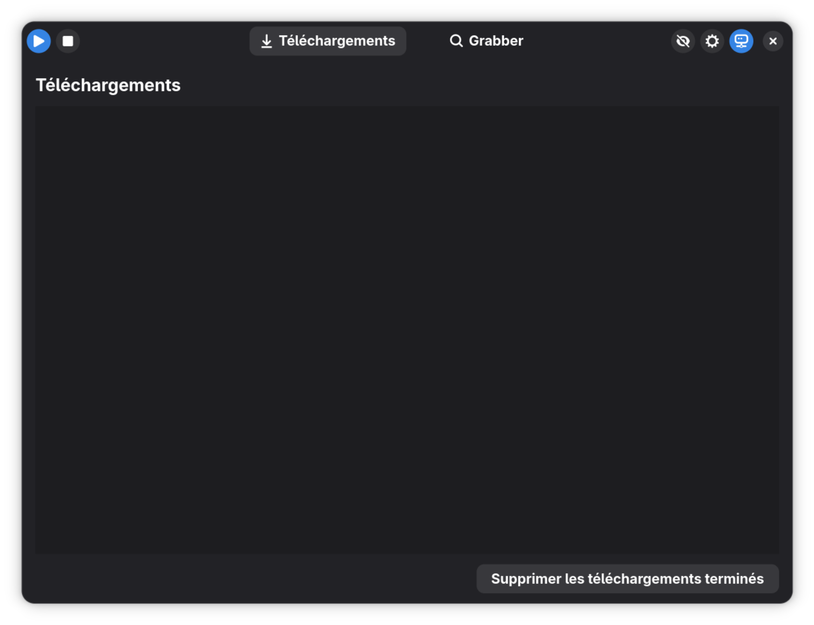
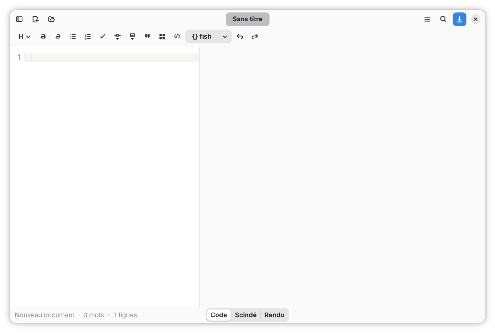
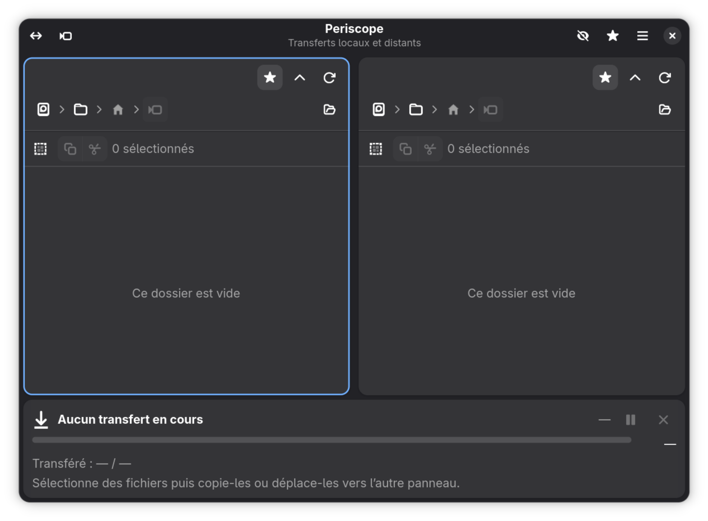
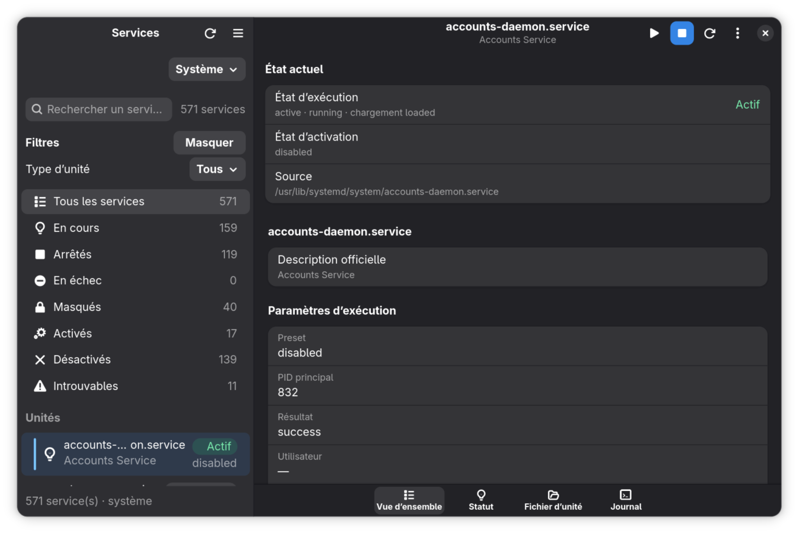
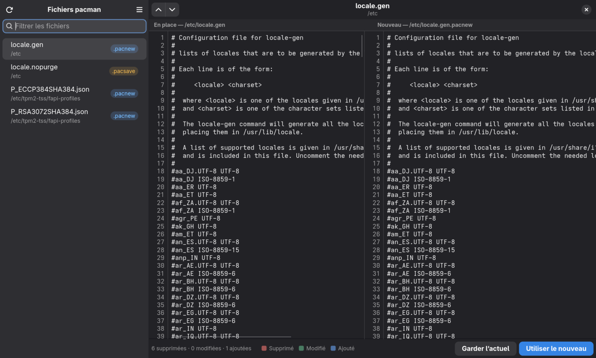
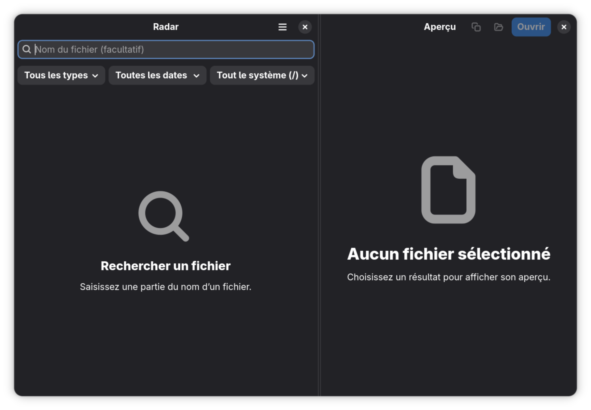
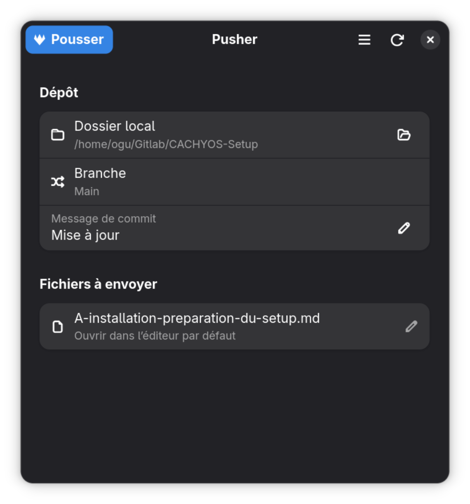

# 12 — Applications Vibe Coded

[Accueil](../README.md) · [Précédent](11-logiciels.md) · [Suivant](13-shell-terminal.md)

> **Dans ce chapitre :** applications personnelles développées avec l'aide du Vibe Coding, principalement en GTK4/libadwaita, ainsi que l'extension GNOME « Always on top, always on top ».

- [12.1 Always on top, always on top](#121--always-on-top-always-on-top)
- [12.2 Grabber](#122--grabber)
- [12.3 Grimoire](#123--grimoire)
- [12.4 Periscope](#124--periscope)
- [12.5 SCX Manager](#125--scx-manager)
- [12.6 systemd](#126--systemd)
- [12.7 Decibel](#127--decibel)
- [12.8 Fisherman](#128--fisherman)
- [12.9 Pacto](#129--pacto)
- [12.10 Radar](#1210--radar)
- [12.11 Pusher](#1211--pusher)

## 12.1 — Always on top, always on top

Extension GNOME Shell minimaliste ajoutant une icône dans la barre supérieure pour activer ou désactiver le mode natif **Toujours au premier plan** de la fenêtre active.

L'extension est compatible GNOME Shell 45 à 50, sans dépendance ni panneau de préférences.


### Installation

Depuis le dossier contenant l'extension :

```fish
gnome-extensions install --force "always-on-top-always-on-top@localhost.shell-extension.zip"
gnome-extensions enable always-on-top-always-on-top@localhost
```

Sous X11, recharger GNOME Shell avec `Alt+F2`, puis `r`. Sous Wayland, se déconnecter puis se reconnecter.

### Désinstallation

```fish
gnome-extensions uninstall always-on-top-always-on-top@localhost
```

---

## 12.2 — Grabber

Frontend GTK4/libadwaita minimaliste pour JDownloader 2. Il permet de récupérer des liens, sélectionner les fichiers utiles, les ajouter à la file de téléchargement et suivre les téléchargements. L'AppImage embarque son propre Java et JDownloader.

**Version documentée : 0.10.30.**



### Installation

Rendre l'AppImage exécutable puis la lancer :

```fish
chmod +x ./grabber-0.10.30-x86_64.AppImage
./grabber-0.10.30-x86_64.AppImage
```

Les données persistantes de JDownloader sont conservées dans `~/.local/share/jd-adwaita/jdownloader`.

### Désinstallation

Supprimer l'AppImage. Pour supprimer également les données persistantes de JDownloader :

```fish
rm -rf "$HOME/.local/share/jd-adwaita/jdownloader"
```

---

## 12.3 — Grimoire

Éditeur Markdown local GTK4/libadwaita utilisant GtkSourceView 5 et WebKitGTK 6. Il permet de parcourir des dossiers de documents Markdown, éditer les fichiers et afficher leur rendu.

**Paquet fourni : `grimoire-ogu-0.2.0-8-x86_64.pkg.tar.zst`.**



### Installation

```fish
sudo pacman -U ./grimoire-ogu-0.2.0-8-x86_64.pkg.tar.zst
grimoire
```

> Si le copier-coller remplace le nom de commande, utiliser simplement `grimoire`.

### Désinstallation

```fish
sudo pacman -Rns grimoire-ogu
```

---

## 12.4 — Periscope

Gestionnaire de fichiers GTK4/libadwaita à deux panneaux, inspiré de Nautilus. Chaque panneau peut afficher un emplacement local ou une URI GVfs telle que FTP, SFTP ou SMB. Les transferts sont effectués directement entre les deux panneaux.

**Paquet fourni : `periscope-0.1.0-10-any.pkg.tar.zst`.**



### Installation

```fish
sudo pacman -U ./periscope-0.1.0-10-any.pkg.tar.zst
```

Si Shelly est utilisé pour les mises à jour et qu'un paquet AUR du même nom existe, le README du projet recommande de conserver Periscope hors de cette gestion :

```fish
shelly mark ignore periscope --add
```

Pour SMB, installer au besoin :

```fish
sudo pacman -S --needed gvfs-smb
```

### Désinstallation

```fish
sudo pacman -Rns periscope
```

---

## 12.5 — SCX Manager

Réécriture native GTK4/libadwaita de SCX Manager pour GNOME. L'application permet de consulter et piloter `scx_loader`, le service D-Bus qui gère les planificateurs Linux `sched-ext`.

**Version du projet : 0.1.2.** L'archive fournie contient le projet source et son `PKGBUILD`, mais pas de paquet binaire précompilé.

### Installation depuis les sources

Décompresser `scx-manager-adwaita-0.1.2-pacman.zip`, puis :

```fish
cd scx-manager-adwaita
makepkg -si
```

Pour une installation utilisateur depuis les sources, suivre le `README` du projet et utiliser son script d'installation avec le préfixe prévu.

### Désinstallation

Pour une installation Pacman :

```fish
sudo pacman -Rns scx-manager-adwaita
```

Pour une installation par script, utiliser le `uninstall.sh` fourni par le projet.

### Capture

Une capture de l'interface SCX Manager n'a pas été fournie dans cet envoi. Elle pourra être ajoutée ultérieurement sous `../Ressources/screenshots/vibe-coded/scx-manager.png`.

---

## 12.6 — systemd



Frontend GTK4/libadwaita pour l'administration graphique des services systemd. L'application utilise `systemctl` et `journalctl` comme sources de vérité et permet notamment de rechercher les services, consulter leur état, leur unité et leur journal, et effectuer les actions courantes.

**Paquet fourni : `systemd-gui-0.4.0-3-any.pkg.tar.zst`.**


### Installation

```fish
sudo pacman -U ./systemd-gui-0.4.0-3-any.pkg.tar.zst
```

L'application ne doit pas être lancée avec `sudo`.

### Désinstallation

```fish
sudo pacman -Rns systemd-gui
```

---

## 12.7 — Decibel

Fork personnalisé de **Decibels**, le lecteur audio GNOME. Les modifications apportées permettent notamment de supprimer un titre avec `Suppr` et d'éviter l'ouverture d'une seconde fenêtre lorsqu'un fichier audio est ouvert pendant une lecture : le nouveau morceau remplace celui de la fenêtre existante.

**Paquet fourni : `decibel-49.6.1-1-any.pkg.tar.zst`.**

### Installation

```fish
sudo pacman -U ./decibel-49.6.1-1-any.pkg.tar.zst
```

### Désinstallation

```fish
sudo pacman -Rns decibel
```

### Capture

Une capture de l'interface de Decibel n'a pas été fournie dans cet envoi. Elle pourra être ajoutée sous `../Ressources/screenshots/vibe-coded/decibel.png`.

---

## 12.8 — Fisherman


Gestionnaire graphique minimaliste des fichiers de configuration de Fish, notamment `config.fish` et les fonctions Fish.

**Paquet fourni : `fisherman-0.1.0-1-any.pkg.tar.zst`.**

### Installation

```fish
sudo pacman -U ./fisherman-0.1.0-1-any.pkg.tar.zst
```

### Désinstallation

```fish
sudo pacman -Rns fisherman
```

### Capture

Une capture de l'interface de Fisherman n'a pas été fournie dans cet envoi. Elle pourra être ajoutée sous `../Ressources/screenshots/vibe-coded/fisherman.png`.

---

## 12.9 — Pacto

Application GTK4/libadwaita destinée à la gestion des fichiers `.pacnew` et `.pacsave` : collecte, tri, comparaison, édition, remplacement et suppression.

**Paquet fourni : `pacto-1.0.0-1-any.pkg.tar.zst`.**



### Installation

```fish
sudo pacman -U ./pacto-1.0.0-1-any.pkg.tar.zst
```

### Désinstallation

```fish
sudo pacman -Rns pacto
```

---

## 12.10 — Radar

Application GTK4/libadwaita de recherche et de visualisation de fichiers construite autour de `fzf`. Elle fournit une recherche rapide avec aperçu et filtres.

**Paquet fourni : `radar-1.4.0-1-any.pkg.tar.zst`.**



### Installation

```fish
sudo pacman -U ./radar-1.4.0-1-any.pkg.tar.zst
```

### Désinstallation

```fish
sudo pacman -Rns radar
```

---

## 12.11 — Pusher

Application GTK4/libadwaita minimaliste destinée à la gestion graphique du dépôt GitLab personnel. Elle regroupe les opérations courantes autour du dépôt local et de son envoi vers le dépôt distant.

**Paquet fourni : `pusher-1.6.0-1-any.pkg.tar.zst`.**



### Installation

```fish
sudo pacman -U ./pusher-1.6.0-1-any.pkg.tar.zst
```

### Désinstallation

```fish
sudo pacman -Rns pusher
```

---

### Captures d'écran restantes

Les captures fournies avec cette mise à jour couvrent **Always on top, Grabber, Grimoire, Periscope, systemd, Pacto, Radar et Pusher**. Les trois applications suivantes restent volontairement sans capture afin de ne pas fabriquer une représentation de leur interface : **SCX Manager, Decibel et Fisherman**.

---

[Accueil](../README.md) · [Précédent](11-logiciels.md) · [Suivant](13-shell-terminal.md)
